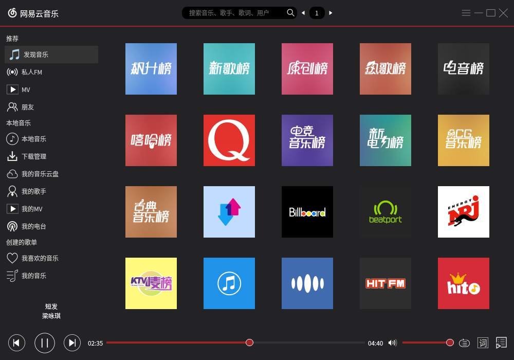
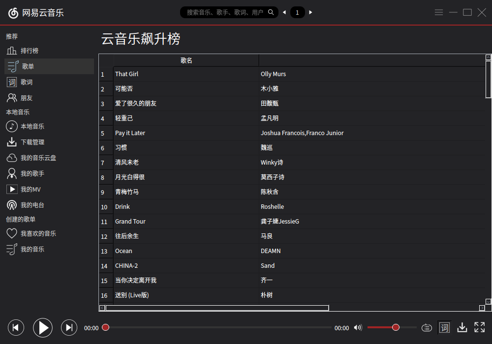
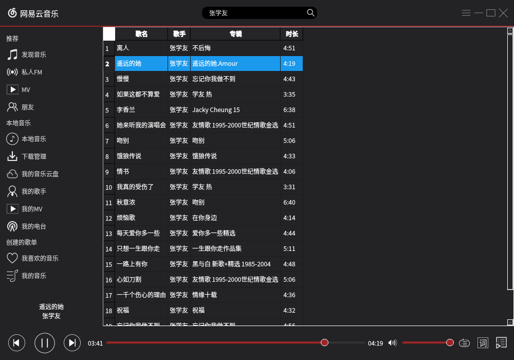

# Qt: 网易云音乐
一款基于Qt5.6的网易云音乐播放器，已编译好的 NeteaseMusic 适用于 Linux 64 位 Qt 5.6 环境。  
已完成功能：排行榜点播，搜索歌曲（暂时不能分页）。  
音乐版权归网易所有。  

  

  

  

### 参考
UI：网页云音乐  
API：  
https://github.com/gcmwhite/CloudMusic-Bc-5  
http://get.ftqq.com/7430.get