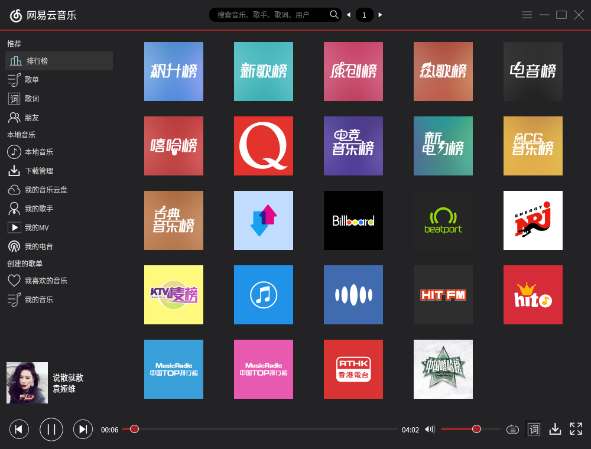
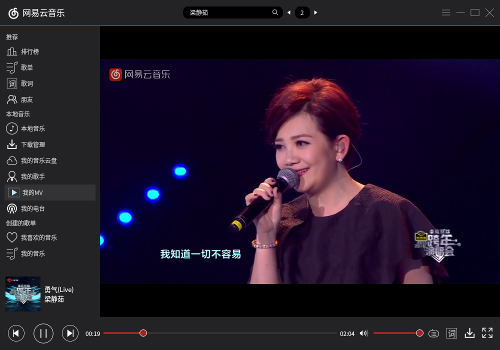

# Qt: 网易云音乐
一款基于 Qt5 的网易云音乐播放器，已编译好的 NeteaseMusic 适用于 Linux 64 位 Qt 5 环境。  
已完成功能：排行榜点播，搜索歌曲，MV。  
音乐版权归网易所有。  

  

  

  

  

  

### 参考
UI：网易云音乐  
API：  
https://github.com/gcmwhite/CloudMusic-Bc-5  
http://get.ftqq.com/7430.get  
https://github.com/metowolf/NeteaseCloudMusicApi

[跳转URL处理](https://blog.csdn.net/mingzznet/article/details/9724371)